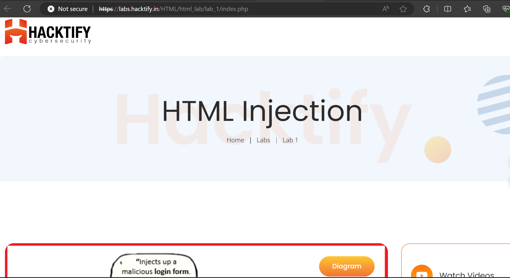
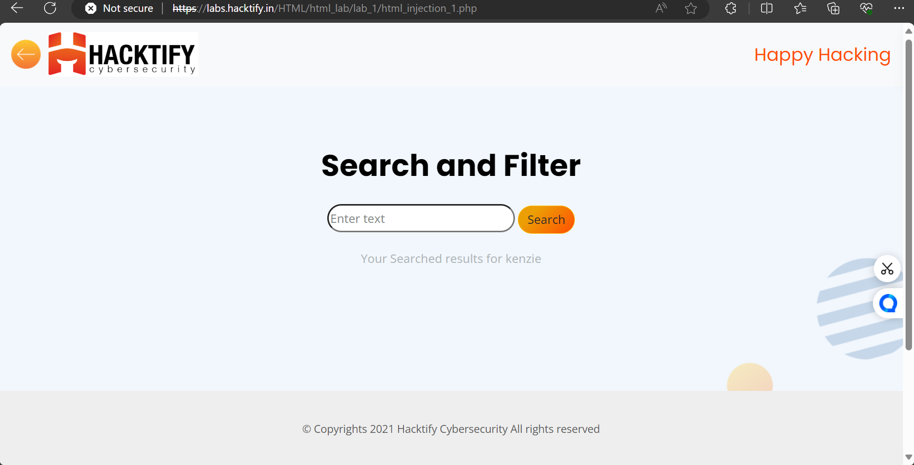
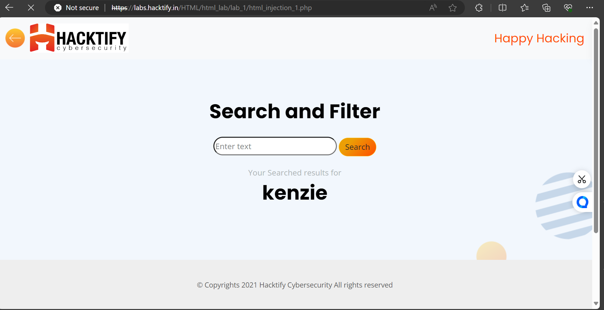
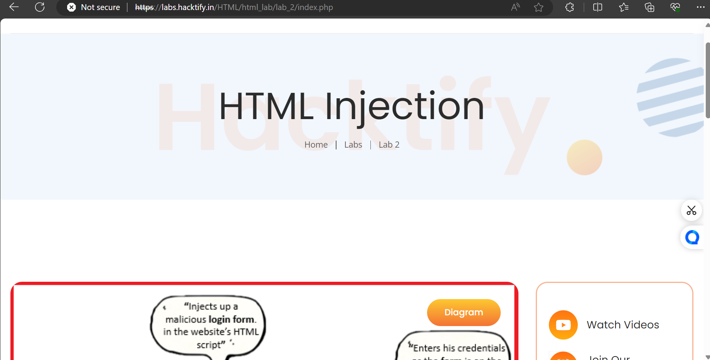

# HTML Injection

Welcome to Lab 1 of the HTML Injection series at Hactify! In this lab, we'll delve into HTML Injection, a common vulnerability in web applications.

## Understanding HTML Injection
HTML Injection arises when web applications inadequately sanitize user input, enabling users to insert HTML code through specific parameters or entry points. Unlike Cross-site Scripting (XSS), HTML Injection permits the injection of select HTML tags. When an application fails to properly sanitize user-supplied data, attackers exploit this vulnerability by injecting valid HTML code, usually through a parameter value, to incorporate their own content into the webpage.

### Severity Assessment
HTML Injection is typically classified as a P4 bug with a CVSS score ranging from 0.1 to 3.9, indicating a Low severity. However, if the vulnerability leads to account takeover scenarios, its severity escalates to P3.

### Exploiting HTML Injection
To exploit HTML Injection effectively, attackers typically follow these steps:
1. **Probe Entry Points:** Test all entry points accessible on the target website to identify potential injection vulnerabilities.
2. **Reference Documentation:** Consult HTML Injection documentation for known techniques and payloads.
3. **Validate Injection:** Inject HTML payloads into input fields and observe whether they render as intended on the webpage.

## Getting Started with Lab 1
To commence Lab 1, follow these steps:
1. Navigate to the Hactify Labs website: [https://labs.hacktify.in](https://labs.hacktify.in).
2. Locate the HTML Labs section.
3. Choose Lab 1 - HTML Injection.
   
4. Review the lab description and provided instructions thoroughly.
5. Click on the "Start Lab" button to initiate the exercise.

## Let's Explore Further
Now, let's delve deeper into the lab tasks:
1. **Verify Name Display:** Input your name into the search bar and press enter. Notice how your name dynamically appears on the page? This illustrates the functionality we'll be examining.
   
2. **Experiment with HTML Injection:** Let's test the vulnerability. Input `<h1>kenzie</h1>` into the search bar and submit. Observe any changes on the page. Voilà! You've injected HTML successfully.
   

This demonstration confirms the susceptibility of the search parameter to HTML injection attacks.

## Getting Started with Lab 2
To commence Lab 1, follow these steps:
1. Navigate to the Hactify Labs website: [https://labs.hacktify.in](https://labs.hacktify.in).
2. Locate the HTML Labs section.
3. Choose Lab 1 - HTML Injection.
   
4. Review the lab description and provided instructions thoroughly.
5. Click on the "Start Lab" button to initiate the exercise.
